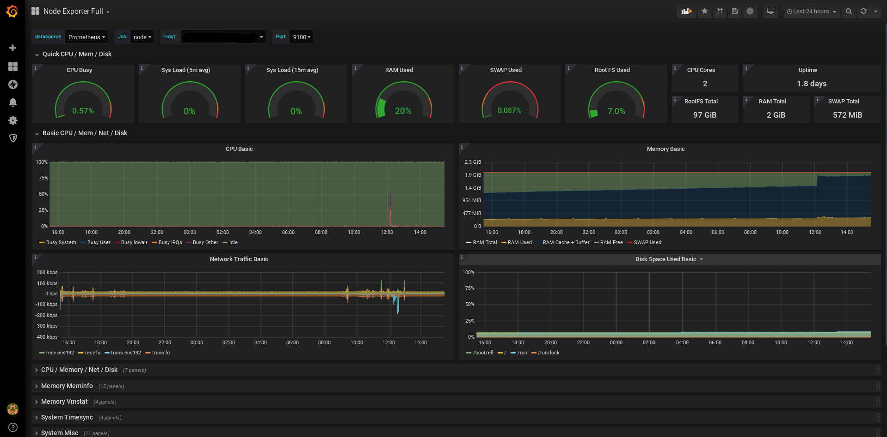

<div align="center">

# monitoring-AIOps-AWS

**End-to-end AIOps / MLOps / Security Analytics platform on AWS**

Terraform · EKS · SageMaker · MSK · OpenSearch · Firehose · GuardDuty · FastAPI · Grafana

[]()
[]()
[]()
[]()
[]()

</div>

---

## Table of Contents

1. [What this is](#what-this-is)
2. [Screenshots](#screenshots)
3. [Why tiered detection](#why-tiered-detection)
4. [Architecture](#architecture)
5. [Data sources & ingestion](#data-sources--ingestion)
6. [Detectors](#detectors)
7. [Repository layout](#repository-layout)
8. [Prerequisites](#prerequisites)
9. [Quickstart — deploy from scratch](#quickstart--deploy-from-scratch)
10. [Anomaly Scoring API](#anomaly-scoring-api)
11. [Common schema](#common-schema)
12. [SLOs](#slos)
13. [Cost estimate](#cost-estimate)
14. [Operational runbooks](#operational-runbooks)
15. [Critical rules](#critical-rules)
16. [Sensitive areas](#sensitive-areas)
17. [Troubleshooting](#troubleshooting)
18. [Contributing](#contributing)
19. [License](#license)

---

## What this is

A production-shaped platform that:

- **Ingests** logs (CloudFront / ALB / WAF / EKS / NGINX / Kafka / MySQL / Mongo / Redis / app JSON), metrics (Prometheus), and traces (OTel) from up to 14 sources.
- **Detects** anomalies and threats using a **four-tier stack** — AWS-managed services, streaming statistical rules, OpenSearch Anomaly Detection, and SageMaker ML models.
- **Serves** anomaly scores + explanations through a FastAPI service on EKS behind an ALB, Cognito-authenticated.
- **Monitors** its own inputs for drift and retrains models on schedule / on drift.
- **Costs** ~USD 30–45 / day when idle in `dev`, scales to prod-grade in the same code with a workspace change.

Everything is IaC (Terraform). Everything runs in AWS. Deploys are triggered from a laptop but *executed* in AWS via CodeBuild — see [`docs/WORKFLOW.md`](docs/WORKFLOW.md).

---

## Screenshots

Sample look-and-feel of the analyst-facing surfaces (real per-deploy renders live in `docs/img/` after apply).

### AIOps dashboard (Grafana / Managed Grafana)


### Anomaly Scoring API — Swagger UI


> These are placeholder samples so you can see the target UX without waiting for a full deploy. Replace with `chrome --headless --screenshot` captures once your ALB/AMG endpoints are live (commands in [`docs/WORKFLOW.md`](docs/WORKFLOW.md#capture-commands-run-after-deploy)).

---

## Why tiered detection

Anomaly detection is not free of cold-start. **The platform does not detect ML-driven anomalies on day one.** Unsupervised models (RCF, Isolation Forest, autoencoders) need a baseline of "normal" before they can flag "abnormal". That is intrinsic; you cannot remove it. So the stack is layered:

| Tier | Latency | What it does | Cold-start |
|---|---|---|---|
| **AWS-managed** | seconds | GuardDuty (VPC/CT/DNS), SecurityHub findings, Detective | works immediately |
| **Streaming statistical** (Lambda) | seconds | z-score, EWMA, rate-of-change, threshold rules | works after ~30 min of data |
| **OpenSearch AD plugin** | minutes | RCF on indexed metrics/logs | works after ≥ 32 intervals |
| **SageMaker ML** | hours train, ms inference | RCF, IForest, LSTM-AE, LogBERT-lite | needs 1–7 days representative data |

Real-time prediction is a property of the **inference path**, not training. Models train in batch (Spot), deploy to a SageMaker endpoint, and that endpoint serves ~50–200 ms p99 predictions. A drift-retrain loop keeps them fresh.

---

## Architecture

### Layer view

```
L1  Data Sources     CloudFront · ALB · WAF · App · EKS · NGINX · Kafka · MySQL
                     Mongo · Redis · node/container/Prom · OTel traces
L2  Ingestion        Kinesis Firehose · MSK (Kafka) · Fluent Bit · ADOT collector
L3  Lake / Index     S3 raw partitioned per-source · Glue · OpenSearch
L4  Feature Eng      SageMaker Processing → security_features (sliding windows)
L5  Detection        AWS-managed  +  Lambda streaming  +  OpenSearch AD  +  SM ML
L6  Registry+Deploy  Model Registry · CodePipeline · SageMaker Endpoints · EKS
L7  Monitoring       Drift on inputs · CloudWatch · EventBridge → retrain

APP  Anomaly Scoring API   FastAPI on EKS · /score · /alerts · /explain
APP  AIOps Dashboard       Grafana (AMG) + OpenSearch Dashboards
```

### End-to-end deploy pipeline

```
       ┌────────────────────────────────────┐
       │ Laptop  (thin — zip + upload only) │
       └────────────────┬───────────────────┘
                        │
                        ▼
   ═══════════════════════════════════════════════════════════════
   ║                          AWS                                ║
   ║                                                             ║
   ║   S3 source zip ──►  CodeBuild (terraform 1.7)              ║
   ║                          │                                  ║
   ║                          ├─► S3 tfstate + DynamoDB lock     ║
   ║                          │                                  ║
   ║                          └─► provisions:                    ║
   ║                              VPC, EKS, MSK, Firehose,       ║
   ║                              OpenSearch, SageMaker, RDS,    ║
   ║                              Cognito, ALB+WAF, GuardDuty,   ║
   ║                              SecurityHub, AMP, AMG, CT      ║
   ║                                                             ║
   ═══════════════════════════════════════════════════════════════
```

Full runbook: [`docs/WORKFLOW.md`](docs/WORKFLOW.md).

---

## Data sources & ingestion

| Source | Format | Path |
|---|---|---|
| CloudFront | W3C extended | CF logging → S3 → Firehose transform → S3 raw Parquet |
| ALB | CLF-ish | ALB access log → S3 → Firehose transform → S3 raw Parquet |
| WAF | JSON | WAF logging → Firehose → S3 raw |
| Application logs | JSON / structured | Fluent Bit DaemonSet → MSK → Glue ETL → S3 |
| EKS audit / control plane | JSON | CloudWatch Logs subscription → Firehose → S3 |
| NGINX | combined log | Fluent Bit (`tail /var/log/nginx/*.log`) → MSK → S3 |
| Kafka broker | JMX / log4j | Kafka Connect → MSK → S3 |
| MySQL | slow-query / general | RDS log export → Firehose → S3 |
| MongoDB | log lines | Fluent Bit sidecar/agent → MSK → S3 |
| Redis | log lines | Fluent Bit sidecar → MSK → S3 |
| Node metrics | Prometheus | node_exporter → ADOT → AMP |
| Container metrics | Prometheus | cAdvisor / kubelet → ADOT → AMP |
| App metrics | Prometheus | scraped by ADOT → AMP |
| OpenTelemetry traces | OTLP | App SDK → ADOT → X-Ray + S3 archive |

---

## Detectors

### 1 — RCF Metrics
- **Type**: Unsupervised, streaming-friendly
- **Algo**: SageMaker Random Cut Forest
- **Input**: `(source, host, metric)` sliding-window vector — `request_rate_5m`, `error_rate_5m`, `p99_latency_5m`, `cpu_util_5m`, `mem_util_5m`
- **Output**: `anomaly_score` (float ≥ 0; > 3.0 = strong)
- **Instances**: train `ml.m5.xlarge` Spot / infer `ml.t2.medium`
- **Gate**: F1 ≥ 0.70 on injected-attack labelled set
- **Retrain**: daily

### 2 — Isolation Forest on Logs
- **Algo**: sklearn `IsolationForest`
- **Input**: per-window tabular — `4xx_rate`, `5xx_rate`, `distinct_ips`, `distinct_paths`, `auth_failure_rate`, `bytes_p99`, `entropy_path`
- **Output**: `anomaly_score` (negative = anomalous), `is_anomaly` (-1/1)
- **Gate**: precision @ top-1% ≥ 0.80
- **Retrain**: daily

### 3 — LSTM Autoencoder on Traces
- **Algo**: PyTorch LSTM-AE
- **Input**: OTel span sequences per trace — `(service_id, op_id, duration_ms, status_code)`
- **Output**: `recon_error` (MSE); threshold = 95th percentile of training set
- **Instances**: train `ml.g4dn.xlarge` (GPU, Spot) / infer `ml.c5.large`
- **Gate**: AUC > 0.80
- **Retrain**: weekly

### 4 — Log Embedding Anomaly (LogBERT-lite)
- **Algo**: DistilBERT-mini or TF-IDF + IsolationForest fallback
- **Input**: raw log line + structured fields
- **Output**: `anomaly_score`
- **Instances**: train `ml.m5.2xlarge` (or `ml.g4dn.xlarge`) / infer `ml.c5.xlarge`
- **Gate**: precision @ top-1% ≥ 0.75
- **Retrain**: weekly

### Streaming statistical (cold-start)

Lambda triggered by Firehose / Kinesis. Fires from minute one. Rule catalogue in `ml/streaming/rules.yaml`:

```yaml
z-score:         window=5m, threshold=4.0
ewma:            alpha=0.3, deviation=3σ
rate-of-change:  threshold_pct=200%
threshold-static: e.g. error_rate_5m > 5%
distinct-counter: e.g. distinct_src_ips > 10000 in 1m → potential DDoS
```

All emit to the same SNS topic + S3 path as ML detectors so the API treats them uniformly.

---

## Repository layout

```
monitoring-mlops/
├── README.md                        ← you are here
├── buildspec.yml                    ← CodeBuild runbook (terraform init/apply/destroy)
├── infra /                          ← All AWS infrastructure (dir has trailing space)
│   ├── main.tf · variables.tf · outputs.tf · backend.tf
│   └── modules/
│       ├── datalake/                ← S3 raw partitioned per-source, Glue
│       ├── firehose/                ← Firehose → S3
│       ├── msk/                     ← Managed Kafka
│       ├── opensearch/              ← OpenSearch domain + AD detectors
│       ├── sagemaker/               ← Feature Store, Endpoints, Model Registry
│       ├── eks/                     ← EKS + IRSA (Fluent Bit, ADOT, scoring API)
│       ├── database/                ← RDS analyst metadata (acks, labels)
│       ├── cognito/                 ← Analyst / responder / admin auth
│       ├── alb/  waf/               ← Public ingress for the Scoring API
│       ├── monitoring/              ← CloudWatch alarms, dashboards, retrain Lambda
│       ├── cloudtrail/              ← Account audit
│       ├── billing/                 ← Cost guardrails
│       ├── guardduty/               ← Threat intel
│       ├── securityhub/             ← Findings aggregation
│       ├── amp/  amg/               ← Managed Prometheus / Managed Grafana
│       └── cicd/                    ← CodePipeline (model promotion)
├── ml/
│   ├── parsers/                     ← Per-source log parsers → CommonEvent
│   ├── feature_engineering/         ← Sliding-window security features
│   ├── pipelines/                   ← SageMaker Pipelines (4 detectors)
│   │   ├── rcf_metrics/  iforest_logs/  lstm_autoencoder_traces/  log_embedding_anomaly/
│   ├── streaming/                   ← Lambda statistical detectors
│   ├── monitoring/                  ← Drift detection
│   └── inference/                   ← Local model loaders
├── api/scoring/                     ← FastAPI: /score, /alerts, /explain, /feedback
├── helm/
│   ├── charts/anomaly-scoring-api/  ← API on EKS
│   ├── charts/fluent-bit/           ← DaemonSet
│   └── charts/adot-collector/       ← OTel + Prom-remote-write
├── scripts/
│   ├── seed_logs.py                 ← Synthetic logs across 14 sources
│   ├── inject_attack.py             ← DDoS / brute force / slow-loris
│   ├── smoke_test.sh · teardown.sh
├── tests/{unit,integration,load}/
├── argocd/
└── docs/
    ├── WORKFLOW.md                  ← deploy runbook (start here)
    ├── architecture.md · slo-definitions.md · PRODUCTION-CHECKLIST.md
    └── runbooks/
```

---

## Prerequisites

**On your laptop**
- AWS CLI v2 configured with a profile in the target account (`aws sts get-caller-identity` should succeed)
- `zip` + `bash` (already on macOS/Linux)
- No terraform / kubectl / docker required — everything runs in AWS

**In your AWS account**
- Admin-ish user or role that can create IAM, S3, DynamoDB, and CodeBuild resources (needed once for bootstrap)
- Region with EKS 1.30, MSK, OpenSearch, SageMaker, and AMG availability. `ap-south-1` is the primary target
- Service quotas raised if you hit them: EIP (for NAT), MSK broker slots, SageMaker endpoints

---

## Quickstart — deploy from scratch

```bash
# 0. clone
git clone git@github.com:<owner>/monitoring-AIOps-AWS.git
cd monitoring-AIOps-AWS

# 1. bootstrap remote state (one-time per account)
bash "infra /bootstrap_state.sh"

# 2. create CodeBuild service role + project (one-time)
#    (see docs/WORKFLOW.md → Handy pointers for the exact commands)

# 3. package repo + upload
zip -qr /tmp/src.zip . -x '.venv/*' '**/.terraform/*'
aws s3 cp /tmp/src.zip s3://monitoring-mlops-cb-source-<ACCOUNT_ID>/source.zip

# 4. plan (safe, no changes)
aws codebuild start-build --project-name monitoring-mlops-tf \
  --environment-variables-override name=TF_ACTION,value=plan,type=PLAINTEXT

# 5. apply (creates real, billable AWS resources)
aws codebuild start-build --project-name monitoring-mlops-tf \
  --environment-variables-override name=TF_ACTION,value=apply,type=PLAINTEXT

# 6. tail logs
aws logs tail /aws/codebuild/monitoring-mlops-tf --follow

# 7. teardown when done
aws codebuild start-build --project-name monitoring-mlops-tf \
  --environment-variables-override name=TF_ACTION,value=destroy,type=PLAINTEXT
```

Every gotcha (trailing-space `infra ` dir, staged `-target` apply, EKS version pinning) is documented in [`docs/WORKFLOW.md`](docs/WORKFLOW.md).

---

## Anomaly Scoring API

```
Base:  https://<alb-dns>/api/v1
Auth:  AWS Cognito JWT — groups: analyst | responder | admin
```

| Method | Path | Purpose |
|---|---|---|
| `POST` | `/score` | Score a single `CommonEvent` — returns `{score, is_anomaly, detector, explanation}`. p99 < 250 ms |
| `GET`  | `/alerts?since=…&source=…&severity=…` | List active + recent anomalies (paginated) |
| `GET`  | `/alerts/{id}/explain` | Top contributing features, baseline vs observed, similar past alerts |
| `POST` | `/feedback` | Analyst label — `true_positive` / `false_positive` / `ignored` — feeds retrain loop |
| `GET`  | `/sources` | Per-source health: ingest rate, last-seen timestamp |
| `GET`  | `/health` | K8s liveness/readiness |
| `GET`  | `/metrics` | Prometheus scrape endpoint |

Interactive Swagger UI at `/docs` (see [screenshot](#anomaly-scoring-api--swagger-ui)).

---

## Common schema

Every parser normalizes to `ml/parsers/__init__.py::CommonEvent`:

```python
{
    "ts":         "iso8601",       # event time
    "ingest_ts":  "iso8601",       # when we received it
    "source":     "cloudfront|alb|waf|app|eks|nginx|...",
    "host":       str,             # node, pod, edge location
    "severity":   "DEBUG|INFO|WARN|ERROR|CRITICAL|None",
    "status":     int | None,
    "latency_ms": float | None,
    "bytes":      int | None,
    "src_ip":     str | None,      # HMAC-hashed except in WAF/CF
    "user":       str | None,      # HMAC-hashed
    "path":       str | None,
    "user_agent": str | None,
    "message":    str,
    "attrs":      dict,
}
```

Full schema, versioning, and evolution rules: `docs/architecture.md`.

---

## SLOs

| SLO | Target |
|---|---|
| MTTD (streaming statistical) | < 90 s |
| MTTD (ML detector) | < 5 min after training cycle |
| Alert latency (API p99) | < 250 ms |
| False-positive rate (after month one of feedback) | < 5% |
| Ingest backlog (Firehose / MSK consumer lag p99) | < 5 min |
| Detector availability | ≥ 99.5% |

Full definitions + error budgets: `docs/slo-definitions.md`.

---

## Cost estimate

Dev workspace, single-region, idle (no traffic, no active training):

| Component | ~USD / day |
|---|---|
| EKS control plane + 2 × m5.large nodes | 8–10 |
| MSK — 3 × kafka.t3.small | 6–8 |
| SageMaker — 4 × ml.t2.medium endpoints | 6–8 |
| GuardDuty + SecurityHub + CloudTrail + AMP + AMG | 2–5 |
| OpenSearch — t3.small.search + 10 GB EBS | 2–3 |
| ALB + WAF | 1–2 |
| NAT Gateway | 1.00 |
| Firehose / Kinesis (idle) | 0–2 |
| RDS db.t3.micro | 0.50 |
| S3 (data lake + tfstate + source) | 0.10 |
| **Total idle** | **~30–45** |

Attack traffic + retraining on top of that. Prod-shape (multi-AZ, r6g.large.search, kafka.m5.large, m5.xlarge nodes) roughly 5–8× higher.

**Cost guardrails** in `infra /modules/billing/` — Budgets alarms at 50/80/100/120% of the monthly cap (default USD 200), with SNS-emailed warnings.

---

## Operational runbooks

| Runbook | Location |
|---|---|
| Deploy from scratch | `docs/WORKFLOW.md` |
| Destroy in the correct order | `scripts/teardown.sh` |
| Something's on fire | `docs/runbooks/` |
| Retrain a detector out-of-band | `docs/runbooks/manual-retrain.md` |
| Scale endpoints for load | `docs/runbooks/scale-endpoints.md` |
| Prod cutover checklist | `docs/PRODUCTION-CHECKLIST.md` |

Teardown order (do NOT skip): SageMaker endpoints → EKS scale-to-0 → MSK → OpenSearch → Firehose → `terraform destroy`.

---

## Critical rules

1. **No PII in security signals**. Hash usernames + IPs (HMAC) in the parser. Raw IPs allowed only in WAF/CloudFront where they *are* the signal.
2. **Cost-aware defaults**. `ml.t2.medium` endpoints in dev. No GPU above `ml.g4dn.xlarge`. Spot for training.
3. **Teardown order is sacred**. See runbook — skipping steps orphans expensive resources.
4. **All Terraform resources tagged** `Project=monitoring-mlops` (see `locals.common_tags`).
5. **Drift on detector inputs, not predictions**.
6. **Detector naming**: `{detector}-{environment}-pipeline`.
7. **Endpoint naming**: `{detector}-{environment}`.

---

## Sensitive areas

Touching any of these has broad blast radius — read the module PRODUCTION-CHECKLIST first:

| Path | Risk |
|---|---|
| `infra /modules/sagemaker/` | Endpoint pool change can drop detection coverage |
| `ml/feature_engineering/security_features.py` | Feature change invalidates baselines — retrain **all** detectors |
| `ml/streaming/rules.yaml` | False positives here drown on-call — tune slowly |
| `infra /modules/opensearch/` | Index schema is hard to evolve — use aliases + reindex |
| `infra /modules/guardduty/` | Disabling = blind to AWS-side threats |

---

## Troubleshooting

| Symptom | Cause | Fix |
|---|---|---|
| `Error: Invalid count argument` on amp/guardduty | `count` uses eks module output, unknown at plan | Staged apply — see [`docs/WORKFLOW.md`](docs/WORKFLOW.md#two-stage-apply--why-it-exists) |
| `unsupported Kubernetes version 1.28` | 1.28 EOL | Bump `var.eks_cluster_version` to 1.30+ |
| CodeBuild `cd: infra: No such file` | Dir has trailing space `infra ` | Detect + rename to `tfroot` in install phase (already done in `buildspec.yml`) |
| `dial tcp: lookup grafana.<region>.amazonaws.com` | AMG endpoint pattern differs — provider bug | Bump `hashicorp/aws` provider or comment out AMG in `main.tf` |
| `SageMaker FeatureGroup: s3:GetBucketAcl AccessDenied` | Feature Store role missing bucket ACL perm | Attach `AmazonSageMakerFeatureStoreAccess` in `modules/sagemaker/iam.tf` |
| `LakeFormation deregister ... service-linked role` | Blocks destroy | Manually delete SLR before re-running destroy — see AWS docs |
| Analyst can't log in | Cognito user not in the correct group | Add via `aws cognito-idp admin-add-user-to-group` |

---

## Contributing

1. Branch off `main`.
2. Every terraform change must pass `terraform fmt` and `terraform validate`.
3. Every python change must pass `pytest tests/unit/` and `ruff check`.
4. Ship a runbook update if you change any operational surface.
5. Update `docs/img/` screenshots if you change dashboards or the API.

---

## License

Apache 2.0. See `LICENSE`.

---

<sub>Built as a learning + reference platform. Not a managed product; expect to fork and adapt for your account, region, and quotas.</sub>
